- - -

## Internet of Things (IoT) and Blockchain Technology

by Steve Huckle

PhD Student at the University of Sussex

s.huckle@sussex.ac.uk

## Presentation Objectives

1. Introduce the ShareLab team at Sussex
2. Give a brief overview of IoT and blockchain
3. Describe some IoT, blockchain based sharing economy scenarios
4. Draw some conclusions about the IoT and blockchain technology

# The ShareLab Team

The University of Sussex, Department of Informatics.

Dr Martin White

. . .

Dr Natalia Beloff

. . .

Rituparna Bhattacharya

. . .

- - -

## Background - Express IT

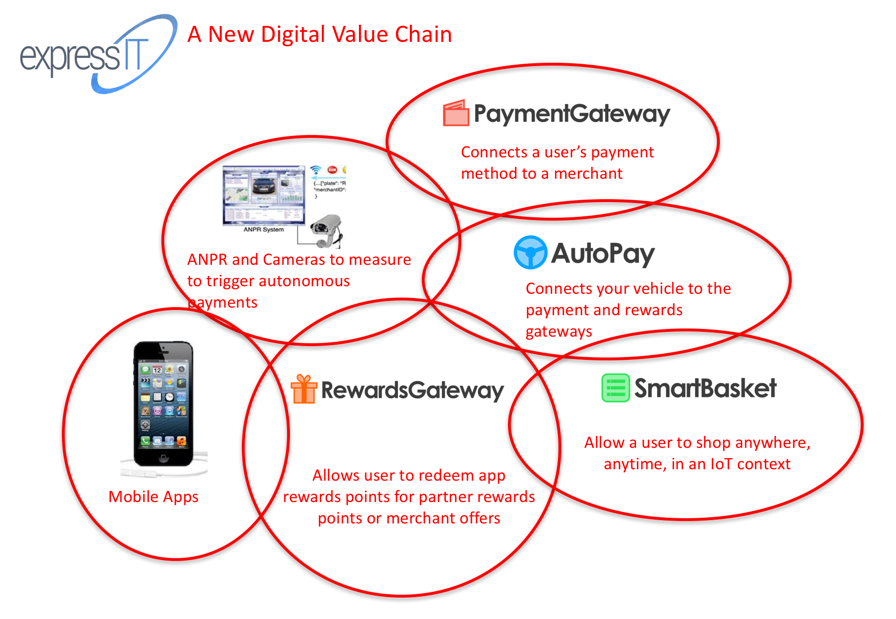

_Image Source: University of Sussex ShareLab_

The University of Sussex and American Express recently concluded a significant InnovateUK (formally the UK Technology Strategy Board) project entitled ‘Connecting Virtual Communities to the Digital Economy Through Micro-Payment Technologies’. The project explored how payments and rewards technologies, particularly micro-payments, could be integrated into digital economy applications.

## The ShareLab's Current Work

Two closely related projects that are underpinned by key IoT and blockchain technologies:

1. Mobile financial wearables and IoT
2. IoT in a sharing economy

## ShareLab Summary

The focus of the ShareLab team are real-world application scenarios and working prototypes of distributed applications (dApps).

# Technology Overview

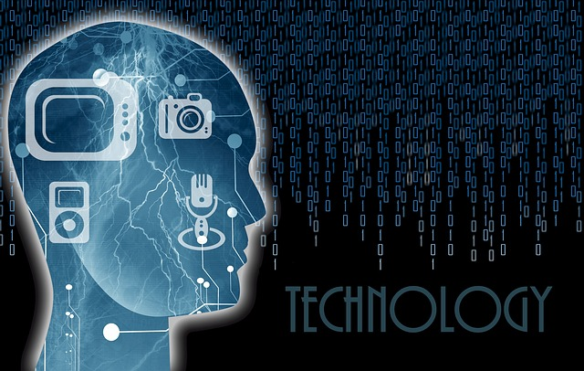

_Image Source: [Vista Education Foundation](http://vistaedfoundation.org/programs/technology/ "Vista Education Foundation")_

- - -

## IoT Overview

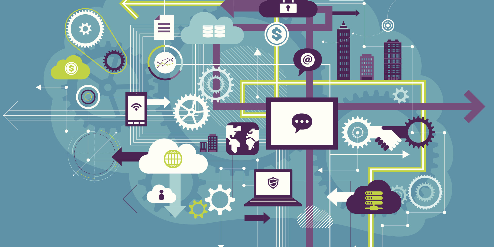

_Image Source: [The Internet of Things](http://electronicsofthings.com/news/products/future-ready-top-10-internet-of-things-devices/ "The Internet of Things")_

## Our Ideas, Rather Than Things

In an interview with RFID Journal1, Kevin Ashton, the man credited with coining the phrase _'Internet of Things'_, described the Internet as being dependent on human beings. Hence, the Internet represents our ideas, rather than ‘things’.

_1. K. Ashton, “That ’Internet of Things’ Thing - RFID Journal.” http://www.rfidjournal.com/articles/view?4986, Jun-2009._

Ashton supposed that humans are time limited, so they are unable to capture too many useful real-world ‘things’ (such as data about the fuel that powers our heating or drives our car’s engines).

## Efficient

Ashton concluded that an _Internet of Things_ based on computer-generated data would enable us to become more efficient, because: “we would know when things needed replacing, repairing or recalling”1.

_1. K. Ashton, “That ’Internet of Things’ Thing - RFID Journal.” http://www.rfidjournal.com/articles/view?4986, Jun-2009._

## IoT Enabling Technologies

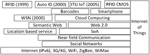

_Image Source: S. Li, L. D. Xu, and S. Zhao, “The Internet of Things: A Survey,” Information Systems Frontiers, vol. 17, no. 2, pp. 243–259, Apr. 2015_

## Key IoT Ideas

_“making a computer sense information without the aid of human intervention”_1

_1. J. Gubbi, R. Buyya, S. Marusic, and M. Palaniswami, “Internet of Things (IoT): A vision, architectural elements, and future directions,” Future Generation Computer Systems, vol. 29, no. 7, pp. 1645–1660, Sep. 2013._

## Key IoT Ideas (cont'd)

_“inter-connected worldwide network based on sensory, communication, networking, and information processing technologies”_1

_1. S. Li, L. D. Xu, and S. Zhao, “The Internet of Things: A Survey,” Information Systems Frontiers, vol. 17, no. 2, pp. 243–259, Apr. 2015_

## Key IoT Ideas (cont'd)

_“**Big Data**, whose opportunities and challenges lie not only in the huge volumes involved, but also in the heterogeneity of information assets and their distribution”_1

_1. A. Chianese, F. Marulli, F. Piccialli, P. Benedusi, and J. E. Jung, “An associative engines based approach supporting collaborative analytics in the Internet of cultural things,” Future Generation Computer Systems, May 2016_

## IoT is Cloud Centric

...they have a vision of a _‘cloud-centric IoT’_.

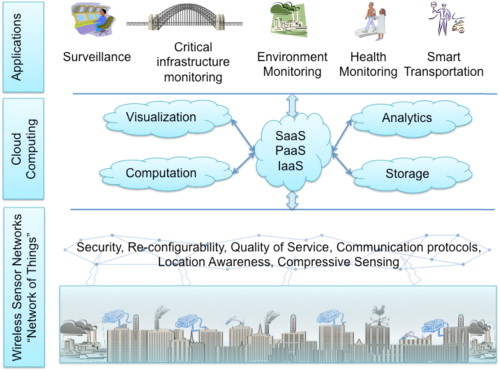

_Image Source: J. Gubbi, R. Buyya, S. Marusic, and M. Palaniswami, “Internet of Things (IoT): A vision, architectural elements, and future directions,” Future Generation Computer Systems, vol. 29, no. 7, pp. 1645–1660, Sep. 2013._

## However...

+ While the cloud-centric model offers a potential solution to scaling to billions of connected devices, it does not necessarily provide a solution to the security challenges of IoT
+ Furthermore, the security and ownership of data created by IoT is a critical issue.

Li et al. list five security and privacy issues that need addressing for IoT: 1) Security and privacy from the social, legal and cultural perspectives, 2) Trust mechanisms, 3) Communication security, 4) User privacy, 5) Security of services and applications.

## ShareLab's Solution...

Sussex's ShareLab believes the solution to security and privacy issues created by IoT lies in trustless peer-to-peer blockchain technology coupled with a hyperlinked file system, such as the InterPlanetary File System (IPFS), which could help distribute digital assets via links on the blockchain.

IPFS works much like the BitTorrent service Pirate Bay.
Such systems overcome security and privacy issues by using public key cryptography. Furthermore, there's no central authority in control. Hence, there's no single point of failure (assuming a functioning Internet).

## Blockchain Overview

_Image Source: [openclipart](https://openclipart.org/detail/225690/bitcoin-maze "openclipart")_

## Essentially a Database

The authors of a report for the UK Government describe the technology as:

_“essentially an asset database that can be shared across a network of multiple sites, geographies or institutions”_1

. . .

The [Bitcoin Website FAQ](https://bitcoin.org/en/faq) puts it this way:

_"Blockchains are the most prominent **triple entry bookkeeping system** in existence."_

_1. [Distributed Ledger Technology: Beyond blockchain](https://www.gov.uk/government/uploads/system/uploads/attachment_data/file/492972/gs-16-1-distributed-ledger-technology.pdf "Distributed Ledger Technology: Beyond blockchain")_

## However...

Blockchain technologies have capabilities far beyond any traditional ledger or ordinary asset database.

## Smart Contracts

+ Algorithms that provide a secure mechanism for electronic collaboration which does not rely upon a central authority for trust
+ Include the concept of smart contracts, which helps automate a system’s rule set because they have the ability to execute autonomous scripts that can represent verifiable application logic

## Shared Public Ledger

+ A blockchain is a trusted, shared public ledger that is open to inspection by everyone, but which cannot be controlled by any single entity
+ Distributed network of transactions where the control of write permissions is via public-private key cryptography  

Hence, you might argue that blockchains represent an irrevocable representation of the truth because they're a permanent and complete record of every transaction that’s ever taken place (on the blockchain).
In other words, the control of write permissions means that blockchains have an inherent _track changes_ ability.

## Blockchain Transaction

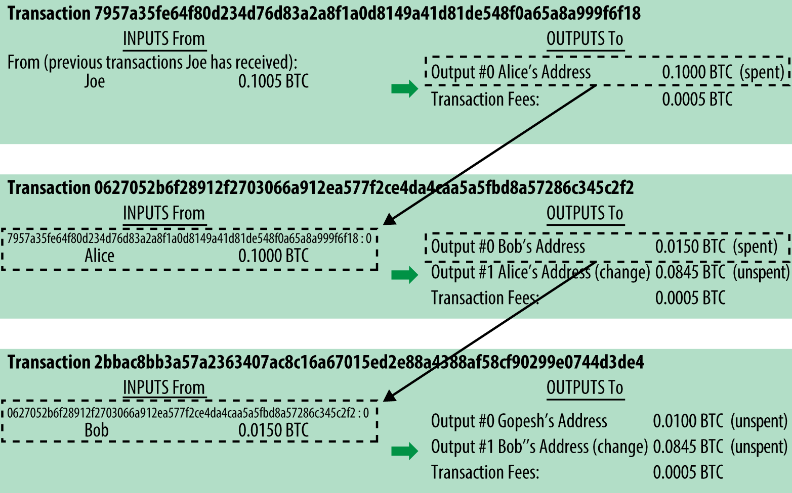

_Image Source: A. M. Antonopoulos, Mastering Bitcoin, First edition. O’Reilly, 2015._

This example shows Alice buying a cup of coffee from Bob’s coffee shop. Alice spends BTC with Bob by using a BTC wallet on her smartphone. She does so by scanning a two-dimensional barcode, known as a QR code, of the payment request generated from Bob’s BTC enabled point-of-sale system. That contains Bob’s destination address, how much Alice should pay and the written description of the trade.

Alice pays Bob for his cup of coffee by creating new outputs from the inputs of a previous transaction with Joe, who used Alice’s public key as the destination address for the BTC involved. When Alice uses some of those funds to pay Bob for his coffee, she supplies her private key to unlock them. That ensures that those transactions are read-only to every other user on the BTC network because it is impossible for anyone to modify them without knowing Alice’s private key. Once the network is satisfied Alice has a sufficient number of BTC to cover the necessary outputs for the transaction with Bob, the required BTC are transferred using Bob’s public key. That encumbers that output with the requirement that, to spend the amount transferred, Bob must produce his private key. In other words, it represents a secure transfer of value between Alice and Bob.

Security of the transfer is enforced by the timestamping and hashing functions of the validators on the Bitcoin network, who form a chain of final transactions. That ensures that even Alice, with her private key, can’t modify confirmed transactions, since it is technically infeasible; she would have to change all the blocks in the chain to change a single block. In 2014, a computing array with the power of 1,753,694 PetaFLOPS would have been needed to make a fake block on the BTC blockchain. At the time, the world’s fastest supercomputer, the Chinese Tianhe–2, could manage 33.9 PetaFLOPS. That means over 50,000 Tianhe–2 supercomputers would be required to attempt to create the fake block.

## Types of Blockchain

Bitcoin, the original blockchain technology, is an open source GitHub project. Hence, any developer can fork the code. Since its launch, Bitcoin has spawned some alternative blockchains:

+ Ethereum
+ Ripple
+ Litecoin
+ Stellar

## Do You _Really_ Need a Blockchain?

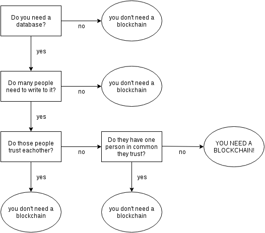

_Image Source: [Do You Need a Blockchain?](https://pbs.twimg.com/media/Cn1YcTwVMAAvzac.png "Do You Need a Blockchain?")_

# IoT and Blockchain History

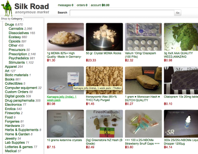

_Image Source: [The Silk Road](http://dev1.ryot.org "The Silk Road")_

- - -

## IoT History

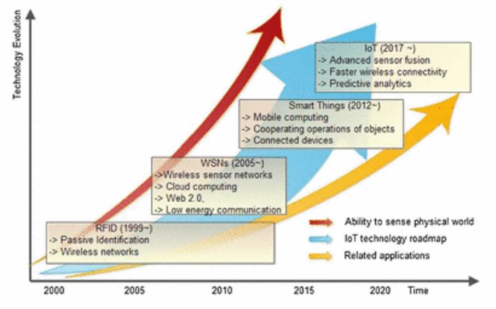

_Image Source: S. Li, L. D. Xu, and S. Zhao, “The Internet of Things: A Survey,” Information Systems Frontiers, vol. 17, no. 2, pp. 243–259, Apr. 2015_

## Blockchain History

> + Blockchain technology, in the form of Bitcoin, began life on 31st October 2008, with the publication of a [2008 white paper by Satoshi Nakamoto](https://bitcoin.org/bitcoin.pdf "Bitcoin White Paper")
> + The first transaction of Bitcoin, in block 170, took place On 12th January 2009
> + On 6th February 2010, the first Bitcoin currency exchange was established
> + On 22nd May 2010, the first real-world transaction took place when the Jacksonville programmer Laszlo Hanyecz paid 10,000 Bitcoin for a pizza

## Blockchain History (cont'd)

> + The notorious online Bitcoin marketplace, Silk Road, known as the ‘eBay for drugs’, opened its doors for business in early 2011. The FBI finally shut the service down in October 2013
> + On 6th December 2012, Bitcoin Central becomes the first Bitcoin exchange to be licensed as a European bank
> + On 2nd May 2013, the world’s first Bitcoin ATM is unveiled in San Diego, California

Ross Ulbricht, aka "Dread Pirate Roberts".

## Blockchain History (cont'd)

> + On 18th November 2013, The U.S. Senate Committee on Homeland Security and Governmental Affairs hold a hearing, discussing Bitcoin, called “Beyond Silk Road: Potential Risks, Threats, and Promises of Virtual Currencies”
> + In September 2014, the U.S. Commodity Futures Trading Commission become the first U.S. regulatory agency to approve a Bitcoin financial product
> + On 11th May 2015, Nasdaq launches a blockchain initiative with the aim of enhancing its equity management capabilities

## Blockchain History (cont'd)

> + 30th July 2015, saw the first live release of the Ethereum project, a smart contract platform based on blockchain technology
> + On 17th December 2015, The Linux Foundation announced a collaborative effort to “develop an enterprise-grade, open source distributed ledger framework.” There are thirty founding corporates collaborating on the project, including companies such as **The London Stock Exchange Group**, **JP Morgan**, **Deutsch Börse**, and **ANZ Bank**
> + On 17th February 2016, IBM released a white paper on their Open Blockchain Initiative

## Blockchain History (cont'd)

> + In May 2016, The DAO, a decentralised autonomous organisation for investor-directed venture capital funding, was installed on Ethereum and crowdfunded via a token sale
> + By early June 2016, The DAO had set the record for the largest crowdfunding campaign in history - **US$150 million**

## Blockchain History (cont'd)

> + However, later that month, hackers syphoned off one-third of The DAO's funds by exploiting a vulnerability in the DAO code
> + On the 20th July 2016, it was decided to hard-fork the Ethereum blockchain to restore virtually all the syphoned funds

## Blockchain History (cont'd)

[Blockstars.io](https://www.blockstars.io/ecosystem/) currently lists 267 blockchain based projects on its _"blockchain ecosystem"_

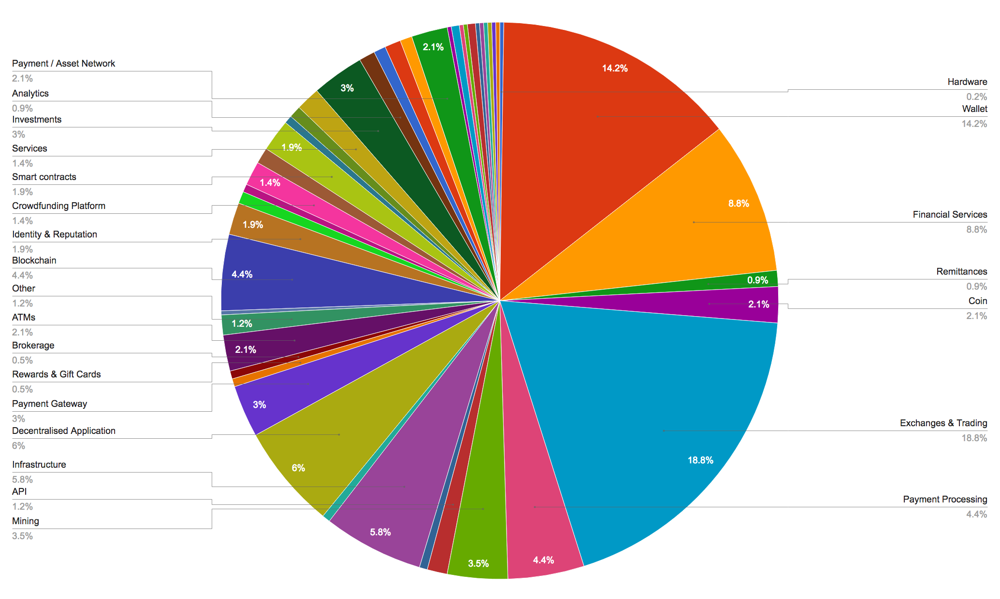

# ShareLab Scenarios

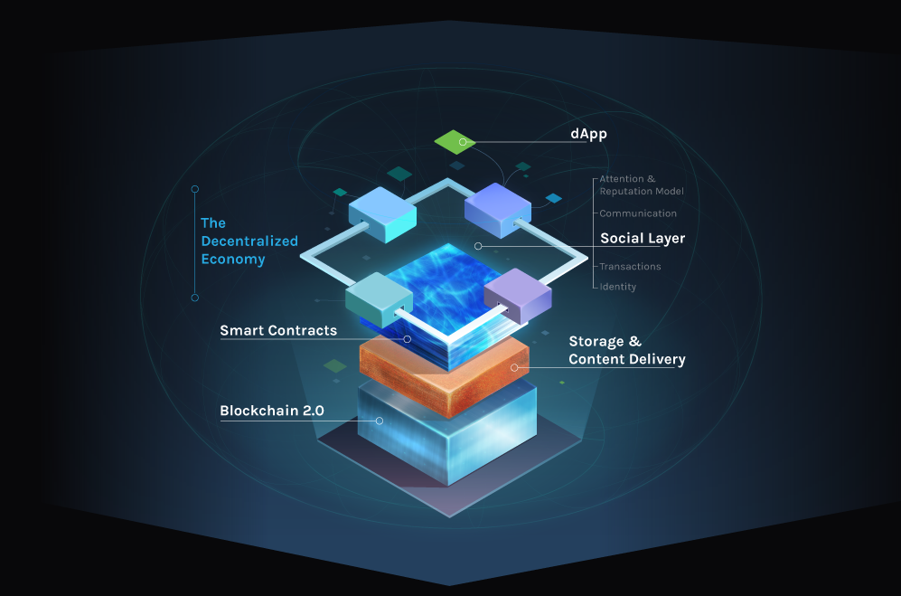

_Image Source: [Synereo](https://www.synereo.com/ "Synereo")_

- - -

## AutoPay

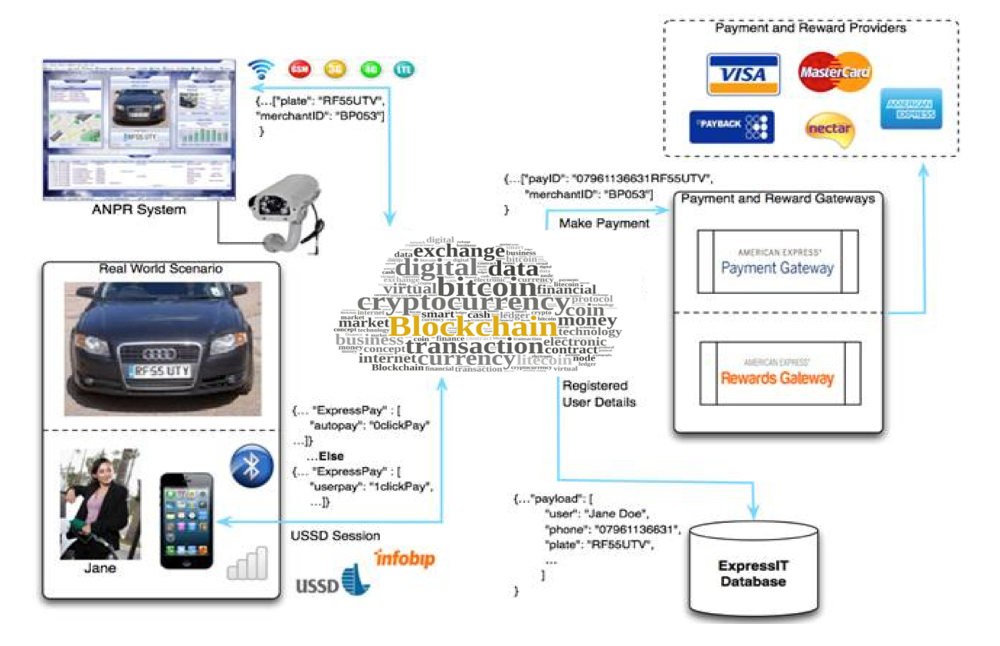

_Image Source: University of Sussex ShareLab_

Jane gets into her car to drive to work; she’s a busy mother and senior manager for a large corporate. The car automatically synchronises with Jane’s smart phone’s AutoPay service, a system that provides security and trust by ‘embodying’ Jane through smart contracts on its blockchain interface. That allows it to operate as an Autonomous Payment device. AutoPay initiates several features on Jane’s in-car display; it links to Journey Planner (JP), and Jane enters into AutoPay JP her office as her destination. AutoPay JP determines, by interrogating vehicle data, that the car is low on fuel, so it automatically plots a route via a convenient petrol station that is advertising competitive fuel prices. After filling up with fuel (automatically paid for by AutoPay’s smart contract feature), Jane receives a message over the AutoPay Siri interface that her work car park is full and that AutoPay JP has initiated a smart contract exchange and paid for another car park, a short distance from her office.

While at work, Jane receives a message that SmartBasket has tendered her daily shopping list to local retailers, determined the one with the best prices, paid for it all, and has organised delivery, which arrives soon after Jane gets home from work. Later that same evening, Jane’s daughter, Alice, asks to borrow the car. Alice’s smart contract with Jane’s car gives her access, but it does not enable the vehicle to make autonomous payments for everything; smart contracts are precisely that; smart, they are customisable for each family member. So, Alice can refuel, but she can’t treat her friends to a drive through MacDonalds using her mother’s AutoPay service. Besides, even if Alice were able to pay for things she should not, Jane would quickly find out because she would be able to check the immutable transaction history on AutoPay’s interface to the car’s blockchain’s ledger.

## Digital Rights Management

_Image Source: [ujo music](http://ujomusic.com/ "ujo music")_

2012 was the first year that electronic sales of songs surpassed those of their physical counterparts. However, that has not dawned a golden age for music because of problems with the distribution and monetisation of digitised copyrighted material. Then there are a myriad of rights; sync rights, mechanical royalties, songwriter royalties and performance fees. As a consequence, streaming revenue can go to many services, and the artists themselves rarely receive much more than a tiny percentage of the monies generated.

Imogen Heap tried to overcome all that by releasing her latest song, Tiny Human, on the prototype music platform ujo music, which uses blockchain technology to detail under what terms the track may be downloaded. The technology also describes how automated payments are distributed to the song’s different contributors. Furthermore, when someone streams the song, the transaction is permanently recorded on the blockchain, which makes it amenable to all kinds of data visualisations and data mining techniques. Moreover, Heap receives immediate payment. That in itself could be a game changer since, currently, it can take months for an artist to receive their royalty payments.  

However, Tiny Human is still centrally stored. To support the distributed model, Heap could make the song available on IPFS, via a link on the blockchain. Thus, it would maximise Heap’s opportunities for revenue because her song could achieve high throughput streaming in a manner that’s fault tolerant.

Music is not the only medium that could benefit from the blockchain and IPFS model. Any digital assets could be distributed that way, with huge implications for electronic media. Legal systems currently consider such intangible assets as non-rivalrous, which means that digital media has long since been caught in the quagmire of intellectual property law because there is, supposedly, no way to prevent their duplication. The result is that users own practically no online material; instead, they merely license such material. However, because blockchain technology has mechanisms that resist falsification and duplication, it could change that and make intangible assets rivalrous. Furthermore, blockchains do that at a very low cost, which supports the type of micropayment models required by music streaming services. Hence, we imagine a future of transparent ownership and use of all digital assets, via blockchains.

## Leftover Foreign Currency

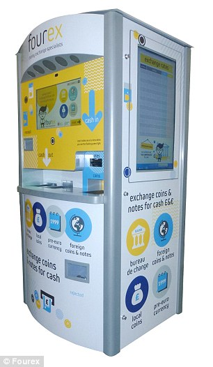

_Image Source: [This is MONEY](http://www.thisismoney.co.uk/money/holidays/article-3107546/Kiosk-turns-unwanted-currency-pounds-launches-tube-stations-August-accept-pesetas-schillings.html "This is MONEY")_

A study from Zopa indicates that the British alone have an estimated UK£2.92 billion of leftover foreign currency. If the UK situation scales to the global population, then there’s a considerable amount of wealth lying unused.

Imagine a scenario whereby, after returning home to London from a business trip to Chicago, John has with him some United States Dollars (USD) that he no longer needs. At the airport gate, using a bespoke smartphone _foreign exchange_ application, he finds the location of the nearest currency-accepting IoT-enabled smart kiosk. John holds his smartphone close to the booth, which identifies him using near-field communication technology (NFC) to exchange a smart contract via a blockchain application.

John deposits his USD and instantly gets an electronic receipt of the deposit using another blockchain based smart contract exchange. Later,
John posts his USD to GBP exchange rate using an intelligent system application that stays competitive by adjusting automatically using the latest mid-market rates. John soon receives an alert that someone has traded, via a smart contract, at his advertised price and the money has been transferred into John’s bank account.

## PeerBnB

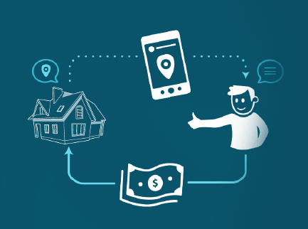

_Image Source: [Synereo](https://www.synereo.com/ "Synereo")_

Landlords get the full service fee. Guests get reduced rates. In fact, it is perhaps ironic that Uber, as one of the most recent disruptive technologies, is an ideal candidate itself for disruption with blockchain.

# Conclusion

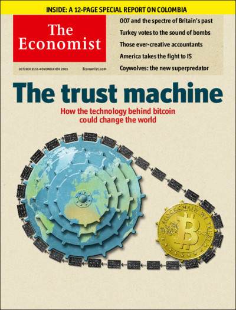

_Image Source: The Economist Front Cover, 31st October 2015_

- - -

## Unexpected Uses

_"Any tool should be useful in the expected way, but a truly great tool lends itself to uses you never expected."_1

_1. Eric S. Raymond: The Cathedral and the Bazaar_

## Blockchain Classes

> + **1.0**: The cryptocurrency class - [Bitcoin](https://bitcoin.org/en/)
> + **2.0**: The provenance class - market services, such as bond trading, deed transfer, or smart contracts - [Ethereum](https://www.ethereum.org/)
> + **3.0**: Classes beyond finance - health, science, arts or culture

## The Impact of Blockchain Technology

_"At the very least, blockchain technology could provide an economic layer for the Internet, allowing for seamless asset transfer and contract exchange on a much larger scale than has hitherto been possible"_1

_1. Swan: Blockchain: Blueprint for a New Economy_

## The Internet of Things and Blockchain Technology

Sussex's ShareLab believes that Blockchain technology could become the secure backbone of the Internet of Things, able to track device history and allowing smart systems to become autonomous agents.

. . .

Indeed, we believe that it is the blockchain’s trustless public ledger, coupled with a distributed file system model provided by, for example, IPFS, that will address the security, transparency and scaling challenges offered by IoT.

# Thank You
